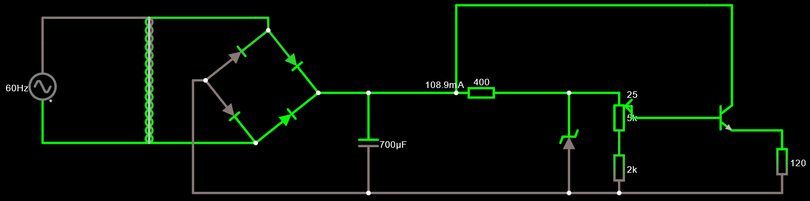
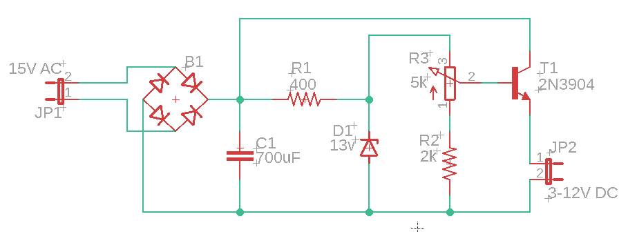
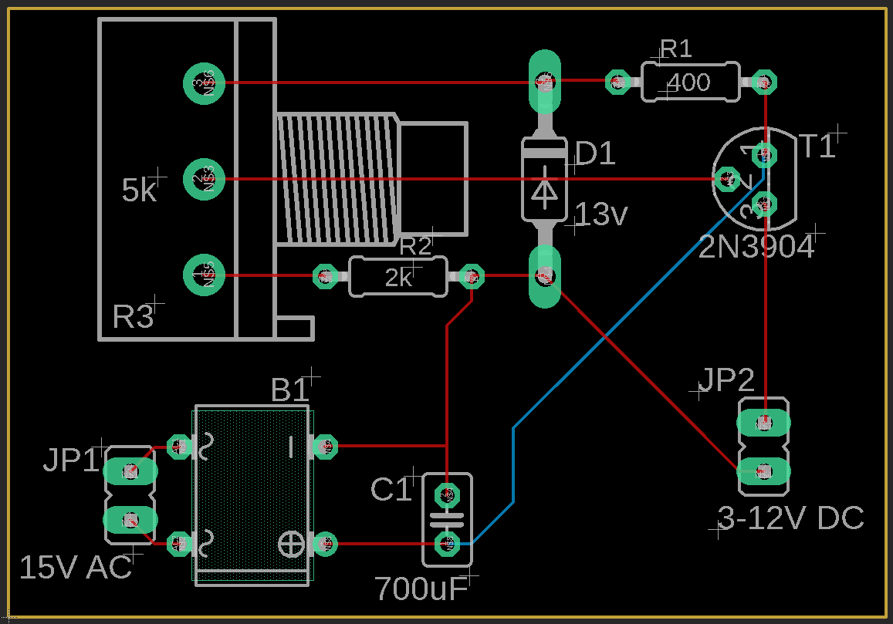

# Projeto de Eletrônica - Fonte Váriavel de 3-12V / 100mA
* **Disciplina:** *SCC0180* - Eletônica para Computação (2021)
* **Professor:** Eduardo do Valle Simões (simoes@icmp.usp.br)

### Grupo
Projeto realizado pelo Grupo 14:
* Fábio Verardino de Oliveira - N. USP: 12674547
* Fabio Henrique Alves Cavaleti - N. USP: 11200550
* Gabriel Fachini - N. USP: 11953481
* Pedro Dias Batista - N. USP: 10769809

---

## Especificações
Para o projeto, deve ser construída uma fonte de retificadora de tensão contínua e variável, entre 3V e 12V. Além disso a fonte deve ser capaz de fornecer 100mA. A entrada da fonte é uma onde senoidal de corrente alternada, com tensão de 127V e frequência de 60Hz.

## Desenvolvimento do circuito
A teoria por traz dos estágios da fonte variável, além dos cálculos que leveram à escolha dos valores dos componentes estão expostas no seguinte documento: [PDF Trabalho de Eletrônica](assets/Trabalho_Eletronica.pdf).

## Circuito no Simulador Falstad
O circuito foi construído no simulador online [Falstad](http://falstad.com/circuit/circuitjs.html), a fim de confirmar o funcionamento da fonte e ajustar os valores dos componentes.

O circuito do projeto pode ser acessado no seguinte link: [Fonte Variável - Falstad][9].

[9]: http://falstad.com/circuit/circuitjs.html?ctz=CQAgjCAMB0l3BWEBOaB2AHAZmcjAWBLANgwCYwsQEzqR8qEBTAWjDACgA3EFsyDODTFe-QWQyDI4EMWlgyaKCDKxkDZAjCQyOLGE1UYCDgHdRAoSL6Ww+fFDMXBdhywzz7j8zfGTnIFiQDpBO7tJBbmKBwY4AJspkZA4e4HIqIHFMAGYAhgCuADYALhwJqWDprir40rRZeUWlCXXJsg6RGQ0FJWXtMQ7VyXWZOT2lPsSDXlPgXqHms9UV804V6SshYbOdO7ELiW1sIklbPpUqRxckUk5DtSqWw96816SPgjcvEp-v+DvvA5YAg1aT-BzPUJYBwALyYADsmAAnNhGcDoMCsJQjSjgDgw+gAwTg0EZOGIlGUJwk540cQPUJgNAOOmk1mdCAIeBQWCQJAAJSYAGcAJZC4q5eEAYyYHCR1AkAwVvykjzg1KJysCgKcWH4pL18kVQP1CkEUyNt0WDzNsjQtFtB2I9vAiudtDICBEoWK1C8ilo7pULvkomgxAQ+DA5HsyBI6ij2IxXLQWH0pDIUyIHTgo0avUWLp+IFTJ38B3Z71L2tu8urxerXyNoQAKrxNrw9iF6Dy7DyBEzXLgMF6FDoqFhoFH8MIEFziMRM8JMSwk7hkBwpR9SdEvrQYPAlGAENAEJp-nZksRKlf+5BOOZi89DaTOPKX8+QZD6OrH08Hk+DJOLu7zFk2HAAPbKLMYKQLgaTSDA3b7oEkEoP0sHwfqk4OhkyCoVBaYYT+WERNAHoZERWBofqMEkfh+oHgoSBUB6ERofoxG1KRPK0BCgQQNRQA

## Esquemático e PCB do circuito no Autodesk EAGLE
Após a simulação do circuito. Foi construído um esquemático do circuito no software Autodesk EAGLE, com o intuito de criar, depois, um modelo da placa de circuito da fonte.

A partir desse esquemático, o mesmo software foi utilizado para montar o modelo da PCB do circuito da fonte.

* Os arquivos do projeto no EAGLE estão no repositório do projeto.

## Componentes utilizados

A lista a seguir contém os componentes utilizados na montagem da fonte, além de links para comprá-los e seus preços:

| Componente         | Especificações      |Quantidade | Preço Unitário | Total    |
|---                 |---                  |--:        |---:            |---:      |
| [Transformador][1] | 127V -> 18V         | 1         | R$ 27.99       | R$ 29.99 |
| [Capacitor][2]     | 1mF / 25V           | 1         | R$ 0.46        | R$ 0.46  |
| [Diodo][3]         | 1N4007              | 4         | R$ 0.10        | R$ 0.40  |
| [Resistor][4]      | 330Ω                | 1         | R$ 0.18        | R$ 0.18  |
| [Resistor][5]      | 2kΩ                 | 1         | R$ 0.05        | R$ 0.05  |
| [Diodo Zener][6]   | VZ = 13V | 1         | R$ 0.19        | R$ 0.19  |
| [Potênciometro][7] | 5kΩ                 | 1         | R$ 1.99        | R$ 1.99  |
| [Transistor][8]    | 2N2222              | 1         | R$ 0.26        | R$ 0.26  |
|                    |                     |           |**Total**      | R$ 33.52 |

[1]: https://www.soldafria.com.br/transformador-18v-500ma-entrada-110-220vac
[2]: https://www.baudaeletronica.com.br/capacitor-eletrolitico-1000uf-25v.html
[3]: https://www.baudaeletronica.com.br/diodo-1n4007.html
[4]: https://www.baudaeletronica.com.br/resistor-330r-5-1w.html
[5]: https://www.baudaeletronica.com.br/resistor-2k-5-1-4w.html
[6]: https://www.baudaeletronica.com.br/diodo-zener-1n4743-13v-1w.html
[7]: https://www.baudaeletronica.com.br/potenciometro-linear-de-5k-5000.html
[8]: https://www.baudaeletronica.com.br/transistor-npn-2n2222.html

* Alguns dos valores dos componenetes foram alterados para atender à disponibilidade do mercado. O funcionamento da fonte não é prejudicado ao utilizar-se desses componentes.

## Vídeo explicativo

Também foi gravado, pelos integrantes do grupo, um vídeo explicando o funcionamento do circuito e dos componentes que o compõem, além dos calculos realizados para a escolha daqueles.

* [Vídeo do projeto](https://youtu.be/JVlfiyRQYMs)

---

## Agradecimento

Os integrantes do grupo gostariam de agradecer ao professor Eduardo Simões e ao monitor Gabriel Kuabara por toda a ajuda durante a realização do projeto.
